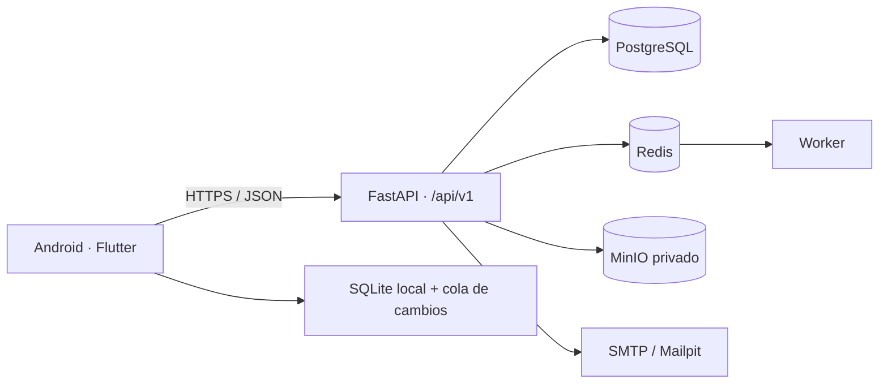
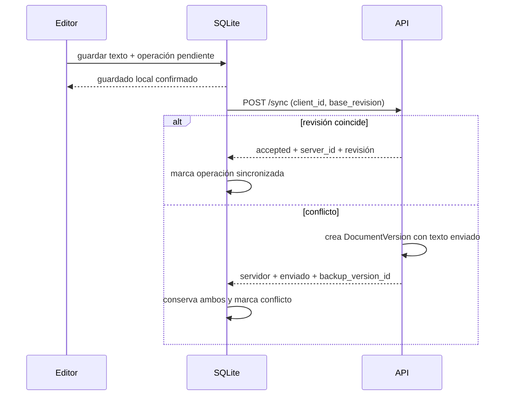
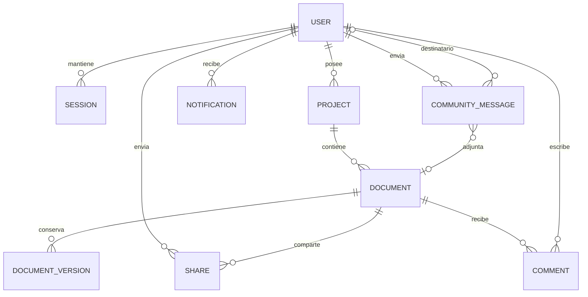

# Arquitectura

## Componentes

El móvil aplica **local-first**: la escritura se confirma primero en SQLite y se
añade una operación idempotente con `client_id`. La API asigna un UUID de
servidor, mantiene `revision` y devuelve cambios posteriores a `since`.

## Sincronización

No se elimina silenciosamente ninguna rama. La interfaz del MVP avisa del
conflicto; una comparación visual de diferencias queda como ampliación.

## Modelo esencial

Los conceptos de capítulo y escena son `Document.kind`; evita tablas duplicadas
y deja una jerarquía flexible para carpetas en una migración posterior.

## Decisiones

1. SQLite con una capa de repositorio manual en el MVP reduce código generado y
   facilita inspeccionar la cola offline.
2. Instantáneas completas por guardado remoto se priorizan sobre diffs: son
   sencillas y seguras para el volumen inicial; se añadirá compactación.
3. La exportación corta es síncrona. Redis y el worker ya dejan el límite para
   EPUB/DOCX y copias grandes.
4. No hay E2EE: el servidor necesita procesar búsqueda, versiones y exportación.
   Se documenta una ruta futura sin atribuir garantías inexistentes.
5. Una publicación a general y/o varios destinatarios se reserva con un
   `client_id` estable y se confirma en una sola transacción. Así, un timeout
   puede reintentarse sin mensajes parciales ni duplicados.
